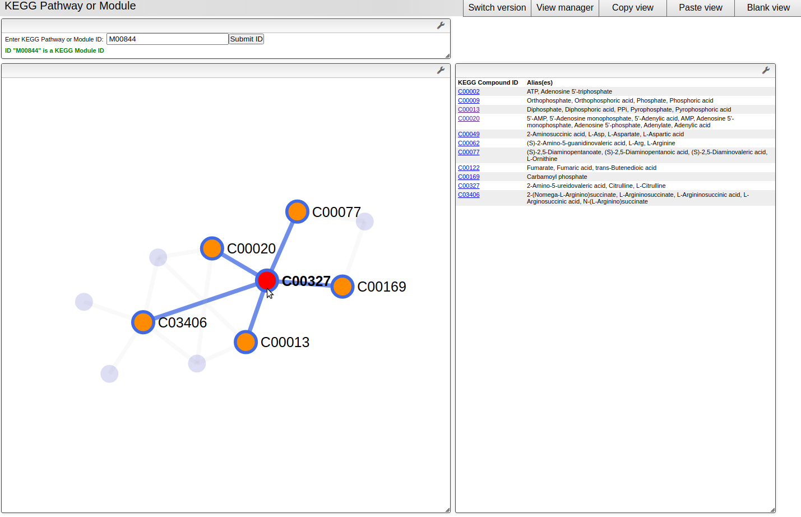

# Visualise KEGG Pathway or Module
#### Mr. George L. Malone
#### 10th of May, 2021

## Overview

This repository contains all scripts and Twig templates (HTML) used in a
ChemInfo view for visualising a KEGG Pathway or Module.  The user enters the
Pathway or Module ID and, if validated correctly, the corresponding data are
visualised.  The work was moved into this repository as it was becoming
somewhat complex to keep track of in the original repository, as well as
departing somewhat from the purpose of the original repo.

## Data

The data used in the ChemInfo view are attached, thus the raw data are not
found here.  Collecting and extracting the data is completed according to the
scripts [here][1] and [here][2], and reformatting the data is completed using
the scripts [here][3] and [here][4].

Effectively, the queried data are objects, wherein the key is the KEGG
Reaction, Module, or Pathway ID.  Pathway IDs can be used to list corresponding
Module or Reaction IDs, but in this case are used to list Reaction IDs only.
Module IDs can be used to list Reaction IDs.  Reaction IDs query the opposing
compounds in the reaction equation, on the left- and right-hand sides of the
reaction.

## Operations

On loading the page, the attached data are loaded and the data objects are
created in the API.  The chart (simulation SVG) is then initialised and
attached to the current window, such that it can be accessed from different
ChemInfo cells and updated as necessary.  The user then enters an ID into a
text input and clicks a button to submit the string.  The string is tested for
suitable patterns, and, if suitable, is sent to the cell to run either the
pathway or module visualisation, depending on the format of the ID.  The
attempt to update the simulation stops with an error if there is no matching ID
found in the data.  Otherwise, the data are queried to discover the appropriate
reaction IDs, and the nodes and links arrays are generated, then created in the
API.  The cell to update the simulation then receives the data, and runs the
update function.

[1]:https://github.com/glm729/mtdtag/blob/master/collect/collect05Kegg.rb
[2]:https://github.com/glm729/mtdtag/blob/master/collect/collect06Kegg.rb
[3]:https://github.com/glm729/mtdtag/blob/master/arrange/arrange06Kegg.R
[4]:https://github.com/glm729/mtdtag/blob/master/arrange/arrange07Kegg.rb
